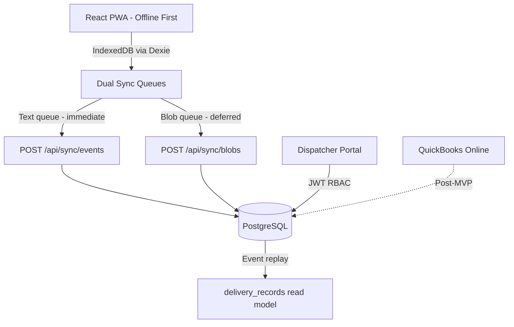

# IAW Courier Delivery Capture SaaS (iaw-saas)

A mobile-first delivery proof-of-delivery (POD) capture system for **IAW Courier**. Drivers capture pickups and e-signatures offline; dispatchers manage waybills globally, apply route pricing, and review tabular job queues. The v1.0.0 Tier 1 stack uses a React PWA frontend, Express/Prisma backend, and append-only event sourcing.

---

## System Architecture



### Key Architectural Pillars

1. **Offline-first PWA**: Lightweight events and heavy blobs sync on separate queues with visible pending counters.
2. **Cryptographic signature integrity**: Signature vectors are hashed with waybill metadata for tamper evidence (mobile prototype + post-MVP hardening).
3. **Append-only event sourcing**: Clients never mutate read tables directly; the server replays `waybill_events` into materialized state.
4. **Database-driven rates**: Flat rates and category rules (Redpath ODP, Victoria Mine, Category 5 nodes, etc.) drive pricing instead of hardcoded UI logic.
5. **Dual auth + RBAC**: Drivers sign in with **username + 4-digit PIN** (e.g. `driver1` / `1111`); dispatchers sign in with **email + password** (or legacy shortcut `dispatch` / `0000` on the driver tab). JWTs gate every API route.
6. **QuickBooks Online alignment**: Operational `status` is separate from `qbo_sync_status` for future invoice sync.

---

## Codebase Structure

```
├── backend/                # Express + TypeScript + Prisma API (:3002)
├── frontend/               # React + Vite PWA with business UI (:3000)
│   └── src/data/
│       ├── suggestions.json      # 40+ pickup locations, conditional dropoffs, addresses
│       └── fallbackWaybills.ts   # Offline cache of seed waybills
├── tests/e2e/              # Playwright Tier 1 specs (F1–F6)
├── docs/                   # Schema DDL, driver/dispatcher SOPs
├── HANDOFF.md              # Milestone status and verification
├── TEST_INFRA.md           # Tier 1 feature/test case definitions
└── mobile/                 # Earlier Expo prototype (reference implementation)
```

The **frontend PWA** now carries the business UI from the pre-agent mobile prototype: tabular dispatch dashboard, location autocomplete chips, conditional dropoff routing, and live route price preview via `frontend/src/utils/pricing.ts`.

---

## Developer Quickstart

### Prerequisites

- Node.js v18+
- PostgreSQL v16

### 1. Install dependencies

From the **project root**:

```bash
npm install
```

### 2. Configure the database

```bash
cp backend/.env.example backend/.env
```

Create the database (once):

```bash
psql -d postgres -c "CREATE ROLE postgres WITH LOGIN PASSWORD 'postgres' SUPERUSER;"
psql -d postgres -c "CREATE DATABASE iaw_courier OWNER postgres;"
```

Push schema and seed synthetic business fixtures (includes last 100 archive CSV rows as `HIST-*` and regenerates `frontend/src/data/topPickups.json`):

```bash
cd backend && npx prisma db push && npx ts-node src/seed.ts && cd ..
```

### 3. Run the app

```bash
npm run dev
```

- **Backend API**: [http://localhost:3002](http://localhost:3002)
- **Frontend PWA**: [http://localhost:3000](http://localhost:3000)

Do **not** run `npx expo start` from the repo root. That command only applies to the legacy `mobile/` prototype.

---

## Production deployment (mckenzian.com)

Live app target: **`https://iaw.mckenzian.com`** (courier PWA; marketing site stays at `mckenzian.com`).

| URL | Purpose |
|-----|---------|
| https://iaw-saas.fly.dev | Fly default hostname (works now) |
| https://iaw.mckenzian.com | Custom domain (after Cloudflare DNS step below) |

Full setup guide: **[DEPLOY.md](./DEPLOY.md)**

**Your one manual step:** In Cloudflare DNS for `mckenzian.com`, add:

| Type | Name | Target | Proxy |
|------|------|--------|-------|
| CNAME | `iaw` | `iaw-saas.fly.dev` | DNS only (grey cloud) |

Then verify: `fly certs check iaw.mckenzian.com --app iaw-saas`

Redeploy after code changes: `fly deploy --app iaw-saas`

---

## Business Domain Reference (Seed & Pre-populations)

All seed data is **synthetic** — never use real customer PII in fixtures.

### Test Accounts

| Role | UI login | API credential | Driver ID |
|------|----------|----------------|-----------|
| Driver 1 | `driver1` / `1111` | PIN `1111` | `drv-01` |
| Driver 2 | `driver2` / `2222` | PIN `2222` | `drv-02` |
| Driver 3 | `driver3` / `3333` | PIN `3333` | `drv-03` |
| Driver 4 | `driver4` / `4444` | PIN `4444` | `drv-04` |
| Dispatcher | **Driver tab:** `dispatch` / `0000` — **or Dispatcher tab:** `dispatcher@example.com` / `password123` | email + password | — |

The login screen has separate **Driver (PIN)** and **Dispatcher** tabs. Driver auth hits `POST /api/auth/driver/login` with the 4-digit PIN; dispatcher auth hits `POST /api/auth/dispatcher/login` with email and password.

### Driver Roster (dispatch chips)

| ID | Name | QBO Driver ID |
|----|------|---------------|
| `drv-01` | Shawn McKenzie | 101 |
| `drv-02` | John Doe | 102 |
| `drv-03` | Sarah Connor | 103 |
| `drv-04` | Alex Mercer | 104 |

### Seed Waybills

| Waybill | Driver | Status | Pickup | Dropoff | Cargo |
|---------|--------|--------|--------|---------|-------|
| **W-001** | drv-01 | `PICKED_UP` | Wajax (Sudbury) | Redpath Mine (Onaping) | Drill Bits |
| **W-002** | unassigned | `DRAFT` | Komatsu (Sudbury) | Victoria Mine | Hydraulic Parts |
| **W-003** | drv-02 | `DRAFT` | Sling Choker (Sudbury) | Creighton Mine | Cables |
| **W-004** | drv-03 | `DRAFT` | Mobile Parts Inc. | Epiroc Lively | Filters |
| **W-005** | drv-04 | `PICKED_UP` | Sandvik Mining | Redpath Mine | Safety Gear |

After login as **driver1**, the dashboard shows W-001 (delivery/sign-off). **driver3** sees W-004 (Pick Up); **driver4** sees W-005 (Deliver). Dispatch sees all five with **Active Jobs**, **Pending Price**, and **Completed** tabs.

### Route Rate Table (`route_rates`)

| Origin | Destination | Flat rate |
|--------|-------------|-----------|
| Sudbury | Lively | $60.00 |
| Sudbury | Chelmsford/Hanmer | $50.00 |
| Sudbury | Val Caron/Azilda | $40.00 |
| Sudbury | Redpath ODP | $125.00 |
| Sudbury | Victoria Mine | $120.00 |
| Category 5 node | Adjacent node | $30.00 |
| Category 5 node | Opposite node | $35.00 |

Dispatcher-only endpoint: `GET /api/admin/rates`.

### Pricing Categories (client-side rules)

Implemented in `frontend/src/utils/pricing.ts` (ported from `mobile/`):

| Category | Example locations | Base price |
|----------|-------------------|------------|
| Category 1 | B&D Manufacturing, Bélanger Construction, Chelmsford/Hanmer | $50 Sudbury ↔ outlying |
| Category 2 | Mobile Parts, DMC Mining, Val Caron/Azilda | $40 Sudbury ↔ outlying |
| Category 3 (Redpath ODP) | Onaping Depth Project (ODP) | $125 |
| Category 4 (Victoria Mining) | Victoria Mine | $120 |
| Category 5 (4-node cycle) | Wajax, Komatsu, Staples, Sling-Choker, etc. | $30 adjacent / $35 opposite |

Surcharges: **+$7.50 per 100 lbs** over 75 lbs, **+$20 skid**, **+$15 rush**.

### Location Pre-populations

`frontend/src/data/suggestions.json` (41 common pickups) powers:

- **Popular pickup chips** on the New Pickup form — top 6 from archive CSV (regenerated on seed), plus **More...** and **Other** for full `suggestions.json` list
- **Searchable autocomplete** for pickup and dropoff
- **Conditional dropoffs** — selecting a pickup narrows likely destinations
- **Auto-filled addresses** from the `locations` map when a known business is selected

Examples of seeded businesses: Wajax, Komatsu (260), Redpath (Falconbridge Rd), Mobile Parts Inc., Sandvik Mining, Victoria Mine, Staples, Epiroc Lively, Sling-Choker Manufacturing, and 30+ more.

---

## Testing

### Full suite

```bash
npm test
```

Run **exactly** that — do not append comments or extra words after the command.

| Command | What it runs |
|---------|--------------|
| `npm test` | Jest backend (2) + Playwright Tier 1 (34) |
| `npm run test:backend` | Backend only |
| `npm run test:e2e` | Playwright only (auto-starts servers) |

First-time Playwright setup:

```bash
npx playwright install
```

### Legacy mobile unit test

The Expo prototype includes a standalone hashing/waybill format test:

```bash
node mobile/src/tests/test_hashing_and_waybill.js
```

---

## Simulating Offline & Conflicts

- **Offline**: Use the **Live / Offline** toggle on the dashboard. Pending events queue in IndexedDB (`iaw_db`) and appear in the pending-sync badge.
- **Conflict simulation (mobile prototype)**: Enter `"conflict"` or `"fail"` in the parcel description during pickup to force a sync conflict badge on the legacy Expo dashboard.

---

## Legacy `mobile/` Expo App

Optional reference implementation with the original full pickup stepper UI:

```bash
cd mobile
npm install
npx expo start
```

Press **`w`** for web (LocalStorage fallback). For v1.0.0 Tier 1 development and E2E verification, use `npm run dev` from the repo root — the frontend PWA now mirrors the core business tables and location pre-populations from this prototype.

---

## Post-MVP Roadmap

1. **Tier 2–4 E2E** and adversarial hardening (`TEST_INFRA.md` Tier 5).
2. **QuickBooks Online** OAuth2 invoice/journal sync.
3. **Production deployment** on Fly.io with CI.
4. **McKenzian boilerplate template** — extract the sync engine after v1.0.0 ships.
