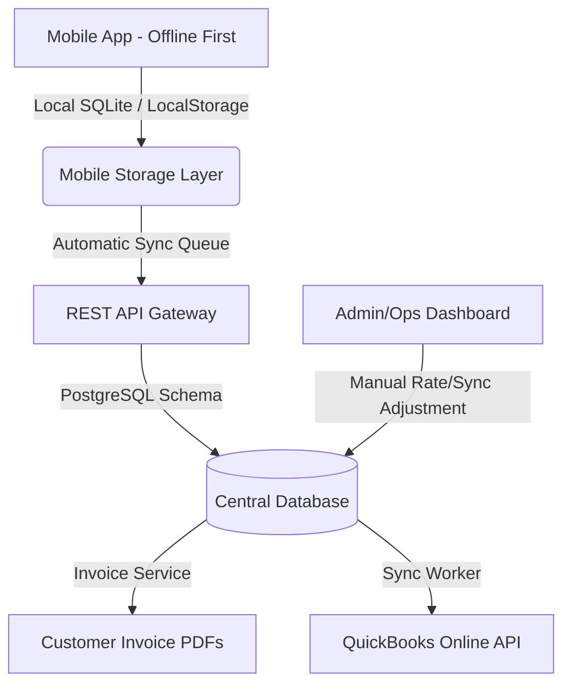

# IAW Courier Delivery Capture SaaS (iaw-saas)

A mobile-first delivery proof-of-delivery (POD) capture system for **IAW Courier**. This application tracks cargo from driver pickup, captures electronic signatures, generates client invoices, and maps delivery logs to QuickBooks Online.

---

## 🏗️ System Architecture



### Key Architectural Pillars
1. **Offline-First Delivery Capture**: Drivers can log pickups and drops in cellular dead zones. Records are saved locally (SQLite/LocalStorage) and queued for automatic sync when network connectivity is restored.
2. **Cryptographic Signature Integrity**: Signatures are secured via a SHA-256 integrity hash capturing the signature vector drawing combined with key waybill metadata to ensure tamper-evidence.
3. **Database-Driven Rates (Tier 1)**: Flat rates for common corporate routes (e.g. Redpath, Wajax, Komatsu) are dynamically looked up in a `route_rates` table to eliminate hardcoded pricing code and maintain transaction audits.
4. **QuickBooks Online Alignment**: Clean separation of operational lifecycles (`status`) and integration synchronization states (`qbo_sync_status`), mapping directly to QuickBooks Online Sales Invoices.

---

## 📂 Codebase Structure

```
├── README.md               # Project overview, architecture, and developer quickstart
├── AGENTS.md               # Guidelines on stack selection, data sensitivity (PII), and sync rules
├── docs/
│   ├── schema.sql          # PostgreSQL DDL (Enums, tables, generated totals, indexing strategy)
│   ├── schema.prisma       # Prisma ORM schema (matches DDL structures for TypeScript backend)
│   ├── driver_instructions.md     # Standard operating procedures for courier drivers
│   └── dispatcher_instructions.md # Standard operating procedures for dispatchers/admins
└── mobile/
    ├── package.json        # Expo/React Native dependency manifest
    ├── App.tsx             # Main container and routing stack
    └── src/
        ├── database/
        │   └── db.ts       # Database access objects (Native SQLite + Web LocalStorage fallback)
        ├── services/
        │   └── SyncManager.ts # Background upload logic and simulated conflict resolvers
        ├── screens/
        │   ├── DashboardScreen.tsx # Job lists, active driver toggle, sync logs
        │   ├── PickupScreen.tsx    # Cargo metadata pickup logging
        │   └── DropoffScreen.tsx   # E-signature consent and POD photo upload
        └── tests/
            └── test_hashing_and_waybill.js # Isolated unit test suite
```

---

## 🚀 Developer Quickstart & Testing

This application uses **React Native + Expo**. The storage engine has built-in fallbacks to **Web LocalStorage**, allowing you to execute, verify, and run the entire driver interface directly inside standard web browsers without native emulators.

### 1. Install Dependencies
Navigate into the `mobile/` directory and install Expo environment dependencies:
```bash
cd mobile
npm install
```

### 2. Run in Development Mode
Start the Expo Metro bundler:
```bash
npx expo start
```
- Press **`w`** to open and run the app in your Web Browser (uses LocalStorage fallback automatically).
- Press **`a`** to launch on an Android emulator or connected device.
- Press **`i`** to launch on an iOS simulator.

### 3. Run Verification Tests
To run unit tests validating client-side waybill formats and signature SHA-256 tamper-evident integrity hashing:
```bash
node mobile/src/tests/test_hashing_and_waybill.js
```

### 4. Simulating Offline & Conflict States
- **Offline Simulation**: The app Dashboard features an interactive **Network Connection Status** switch. Toggle it off to test local SQLite database retention. You can log new pickups and deliveries completely offline, then turn it back on to trigger automatic background synchronization.
- **Conflict Simulation**: To simulate a duplicate waybill/UUID key conflict from the database server, input the word `"conflict"` or `"fail"` inside the **Parcel Description** field when logging a pickup. When synced, the record sync state will be marked as `CONFLICT`, showing an alert badge and offering a manual "Retry Force" resolution button on the Dashboard log.
