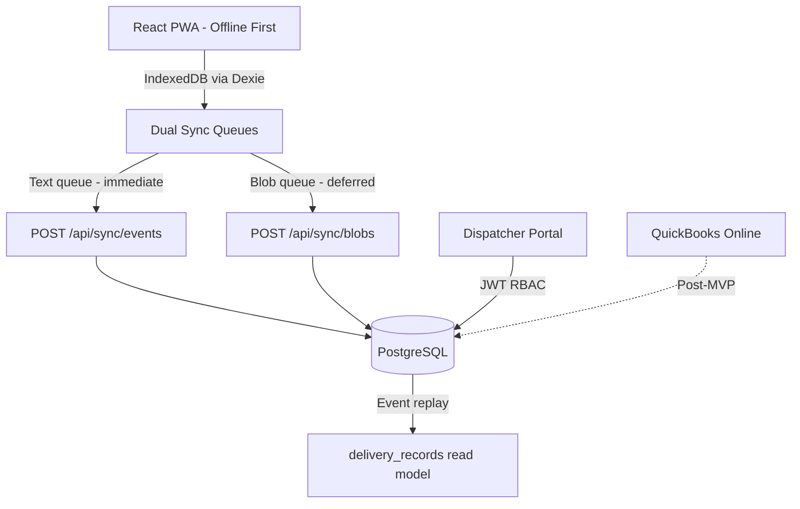

# IAW Courier Delivery Capture SaaS (iaw-saas)

A mobile-first delivery proof-of-delivery (POD) capture system for **IAW Courier**. Drivers capture pickups and e-signatures offline; dispatchers manage waybills globally, apply route pricing, and review tabular job queues. The v1.0.0 Tier 1 stack uses a React PWA frontend, Express/Prisma backend, and append-only event sourcing.

---

## System Architecture



### Key Architectural Pillars

1. **Offline-first PWA**: Lightweight events and heavy blobs sync on separate queues with visible pending counters.
2. **Cryptographic signature integrity**: Signature vectors are hashed with waybill metadata for tamper evidence (post-MVP hardening).
3. **Append-only event sourcing**: Clients never mutate read tables directly; the server replays `waybill_events` into materialized state.
4. **Database-driven rates**: Flat rates and category rules in PostgreSQL drive pricing (see `frontend/src/utils/pricing.ts` and `backend/src/utils/pricing.ts`).
5. **Dual auth + RBAC**: Drivers sign in with **username + 4-digit PIN**; dispatchers sign in with **email + password** on a separate tab. JWTs gate every API route.
6. **QuickBooks Online alignment**: Operational `status` is separate from `qbo_sync_status` for future invoice sync.

---

## Codebase Structure

```
├── backend/                # Express + TypeScript + Prisma API (:3002)
├── frontend/               # React + Vite PWA with business UI (:3000)
│   └── src/data/
│       ├── suggestions.json      # Synthetic pickup/dropoff fixtures
│       └── topPickups.json       # Top pickup shortcuts (regenerated on archive seed)
├── tests/e2e/              # Playwright Tier 1 specs (F1–F6)
├── docs/                   # Schema DDL, driver/dispatcher SOPs, archive.example.csv
├── HANDOFF.md              # Milestone status and verification
└── TEST_INFRA.md           # Tier 1 feature/test case definitions
```

The **frontend PWA** carries the business UI: tabular dispatch dashboard, location autocomplete chips, conditional dropoff routing, and live route price preview.

---

## Developer Quickstart

### Prerequisites

- Node.js v18+
- PostgreSQL v16

### 1. Install dependencies

From the **project root**:

```bash
npm install
```

### 2. Configure environment

```bash
cp backend/.env.example backend/.env
# Edit backend/.env — set SEED_DISPATCHER_PASSWORD and SEED_DRIVER_PINS (never commit real values)

cp frontend/.env.example frontend/.env   # optional: VITE_BUSINESS_EMAIL
cp .env.test.example .env.test           # optional: E2E credential overrides
```

Create the database (once):

```bash
psql -d postgres -c "CREATE ROLE postgres WITH LOGIN PASSWORD 'postgres' SUPERUSER;"
psql -d postgres -c "CREATE DATABASE iaw_courier OWNER postgres;"
```

Push schema and seed synthetic fixtures:

```bash
cd backend && npx prisma db push && npx ts-node src/seed.ts && cd ..
```

Seed requires `SEED_DISPATCHER_PASSWORD` and `SEED_DRIVER_PINS` in `backend/.env`. Optional archive reseed uses `docs/archive.example.csv` or `ARCHIVE_CSV_PATH` pointing to a local CSV (gitignored).

### 3. Run the app

```bash
npm run dev
```

- **Backend API**: [http://localhost:3002](http://localhost:3002)
- **Frontend PWA**: [http://localhost:3000](http://localhost:3000)

---

## Production deployment (mckenzian.com)

Live app target: **`https://iaw.mckenzian.com`** (courier PWA; marketing site stays at `mckenzian.com`).

| URL | Purpose |
|-----|---------|
| https://iaw-saas.fly.dev | Fly default hostname (works now) |
| https://iaw.mckenzian.com | Custom domain (after Cloudflare DNS step below) |

Full setup guide: **[DEPLOY.md](./DEPLOY.md)**

**Your one manual step:** In Cloudflare DNS for `mckenzian.com`, add:

| Type | Name | Target | Proxy |
|------|------|--------|-------|
| CNAME | `iaw` | `iaw-saas.fly.dev` | DNS only (grey cloud) |

Then verify: `fly certs check iaw.mckenzian.com --app iaw-saas`

Redeploy after code changes: `fly deploy --app iaw-saas`

---

## Seed & Test Data

All committed fixtures are **synthetic** — never use real customer PII in the repo.

| Item | Source |
|------|--------|
| Driver accounts | `backend/src/seed.ts` — names `Driver One` … `Driver Four`; PINs from `SEED_DRIVER_PINS` |
| Dispatcher | `SEED_DISPATCHER_EMAIL` + `SEED_DISPATCHER_PASSWORD` in `backend/.env` |
| Location chips | `frontend/src/data/suggestions.json`, `topPickups.json` |
| Archive history | `docs/archive.example.csv` (repo); mount real CSV via `ARCHIVE_CSV_PATH` locally |
| E2E credentials | `.env.test` or same `SEED_*` vars — see `.env.test.example` |

Login UI: **Driver (PIN)** tab for drivers; **Dispatcher** tab for email/password.

---

## Testing

### Full suite

```bash
npm test
```

| Command | What it runs |
|---------|--------------|
| `npm test` | Jest backend + Playwright Tier 1 |
| `npm run test:backend` | Backend only |
| `npm run test:e2e` | Playwright only (auto-starts servers) |

First-time Playwright setup:

```bash
npx playwright install
```

Ensure `backend/.env` has seed credentials before running tests.

---

## Simulating Offline & Conflicts

- **Offline**: Use the **Live / Offline** toggle on the dashboard. Pending events queue in IndexedDB (`iaw_db`) and appear in the pending-sync badge.
- **Conflict simulation**: Enter `"conflict"` or `"fail"` in the parcel description during pickup to force a sync conflict badge on the dashboard.

---

## Post-MVP Roadmap

1. **Tier 2–4 E2E** and adversarial hardening (`TEST_INFRA.md` Tier 5).
2. **QuickBooks Online** OAuth2 invoice/journal sync.
3. **Production deployment** on Fly.io with CI.
4. **McKenzian boilerplate template** — extract the sync engine after v1.0.0 ships.
